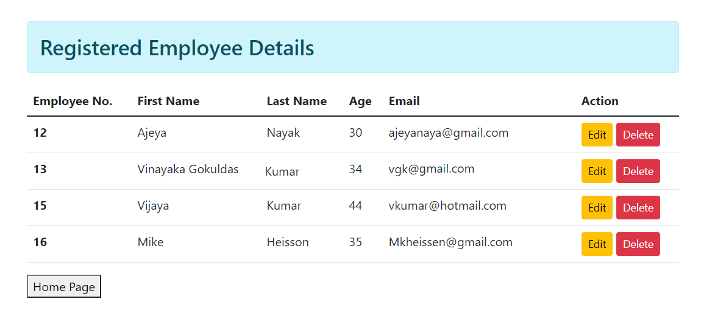

<h1 align="center"> Web application Using Django (CRUD Operation) </h1>

This repository is an attempt to create web application using Python and Django Framework.

The following prerequisites are required: 

1. A website for Employee Registration   
2. A Home page contains Employee Registration forms, User can do employee registration and see registered employees details  
3. User can Change/update employees details .  
4. User can delete employees details  

The following Specifications has to be done: 

1. Django/SQLite3 based webserver listening on localhost at certain specified port for user requests  
2. Endpoints  
    * / or /home - renders index.html, user can register here 
    * /view - renders view_data.html, user can see their details  
    * /update - renders update.html, here user can update their details  
    * /delete - deletes the employee information for the specified row  

Persistence storage
   * The Registered User information will be stored in a database

##  Tasks

User needs to execute the command **Python manage.py runserver** before doing the following and make sure that the webserver is running in background. 

### 1. Creating Database 
Database will be crated during migration and do the manipulations (SQLITE3 CRUD operations) for the Endpoints  

### 2. Registration  

  

User can register on Home page or using "/home" Endpoint  and these user details will be updated in Database  
  
user needs to click on View data once after all informations are updated.
  
### 3. Update user  

User can update or change their information by click on "Edit" Button on View  

  

Once the Edit button was clicked, It prompt the Update screen with user details for specified rows  
  

### 4. Delete user  

  
If user wants to delete any user, can click on delete buttton on specified row  

  

Please note, currently user having full access to delete any user and these can be changed.

<h2>Useful Links :</h2>

| **Sl. No.** | **Link** | **Remarks** |
----------|--------------|--------------
1| [Django Tutorial - Website creation ](https://www.youtube.com/watch?v=OTmQOjsl0eg&t=7748s) | Django Tutorial for Beginners - Full Course (Navin Reddy) |
2| [Django Tutorial - for Beginners ](https://www.youtube.com/watch?v=rHux0gMZ3Eg) | Python Django Tutorial for Beginners (Programming with Mosh) |

